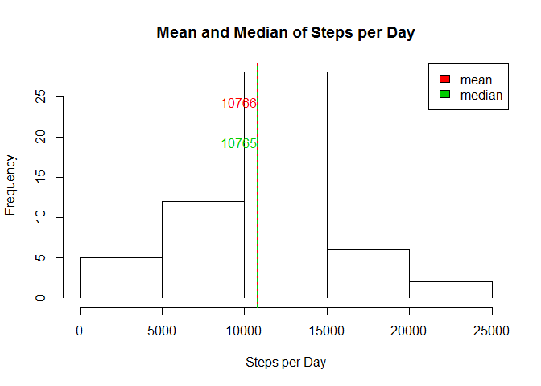
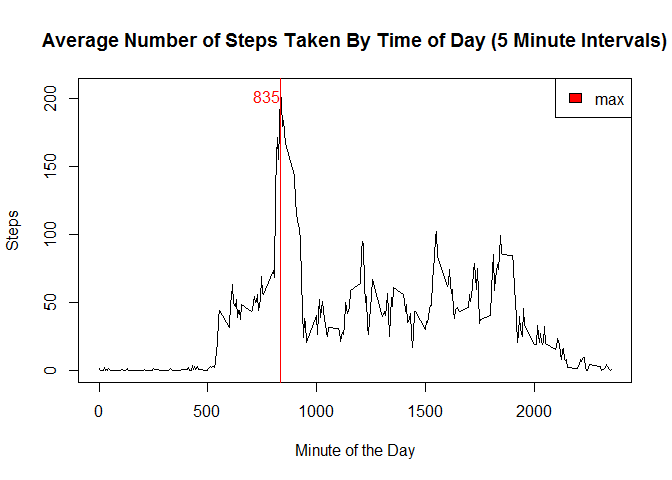
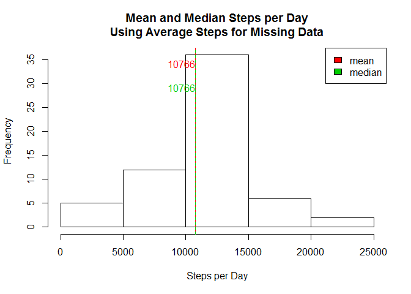
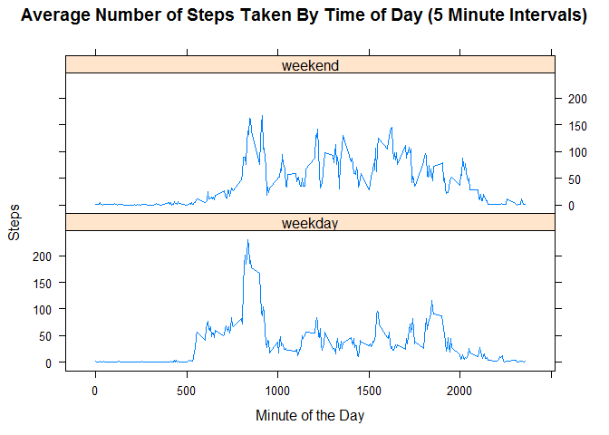

# Reproducible Research: Peer Assessment 1
Loren Lenzen  
January 23, 2016  

## Loading and preprocessing the data

```r
activity <- read.csv("activity.csv")
```

## What is mean total number of steps taken per day?

```r
steps.per.day <- tapply(activity$steps, activity$date, sum)
mean.steps.per.day <- round(mean(steps.per.day, na.rm=TRUE))
median.steps.per.day <- round(median(steps.per.day, na.rm=TRUE))

#create histogram
hist(steps.per.day, 
     main="Mean and Median of Steps per Day", 
     xlab="Steps per Day", 
     ylab="Frequency")
abline(v=c(mean.steps.per.day, median.steps.per.day) , 
       col=c(2,3), 
       lty=c(1,2))
text(x=c(mean.steps.per.day, median.steps.per.day), 
     y=c(25, 20), 
     labels=c(mean.steps.per.day, median.steps.per.day), 
     adj=c(1,1,1), 
     col=c(2,3))
legend(x="topright", 
       legend=c("mean", "median"), 
       fill=c(2,3))
```



## What is the average daily activity pattern?

```r
mean.steps.per.interval <- tapply(activity$steps, activity$interval, mean, na.rm=TRUE)
max.mean.steps.per.interval <- max(mean.steps.per.interval[])
max.interval <- as.numeric(names(which.max(mean.steps.per.interval)))
#time-series line plot by interval
plot(x=as.numeric(names(mean.steps.per.interval)), 
     y=mean.steps.per.interval, 
     main="Average Number of Steps Taken By Time of Day (5 Minute Intervals)",
     xlab="Minute of the Day", 
     ylab="Steps", 
     type="l", 
     col=1)
abline(v=max.interval,
       col=2,
       lty=1)
text(x=max.interval, 
     y=max.mean.steps.per.interval, 
     labels=max.interval, 
     adj=c(1,1,1), 
     col=2)
legend(x="topright",
       legend="max",
       fill=2)
```



## Imputing missing values

Number of missing values: 2304

```r
#copy data frame
imputed.activity <- activity
#get row vector with NA steps
is.na.steps <- is.na(imputed.activity$steps)
#change NA to average to average steps for each interval
imputed.activity[is.na.steps,1] <- mean.steps.per.interval[as.character(imputed.activity[is.na.steps,3])]
#if an interval did not exist in lookup list (no average) then set steps to 0
imputed.activity[is.na(imputed.activity$steps), 1] <- 0

#create histogram with imputed data
steps.per.day <- tapply(imputed.activity$steps, imputed.activity$date, sum)
mean.steps.per.day <- round(mean(steps.per.day))
median.steps.per.day <- round(median(steps.per.day))
hist(steps.per.day, 
     main="Mean and Median Steps per Day\nUsing Average Steps for Missing Data", 
     xlab="Steps per Day", 
     ylab="Frequency")
abline(v=c(mean.steps.per.day, median.steps.per.day) , 
       col=c(2,3), 
       lty=c(1,2))
text(x=c(mean.steps.per.day, median.steps.per.day), 
     y=c(35, 30),
     labels=c(mean.steps.per.day, median.steps.per.day), 
     adj=c(1,1,1), 
     col=c(2,3))
legend(x="topright", 
       legend=c("mean", "median"), 
       fill=c(2,3))
```



## Are there differences in activity patterns between weekdays and weekends?

```r
library(lattice)
library(plyr)
#create weekend/weekday factor
day.type <- sapply(weekdays(as.Date(imputed.activity$date), T), function(x) switch(x, Sun="weekend",  Sat="weekend", "weekday"))
imputed.activity <- cbind(imputed.activity, day.type)

#create data.frame with averages
mean.steps.per.weekday.interval <- ddply(imputed.activity, 
                                         .(interval=imputed.activity$interval, 
                                           day.type=imputed.activity$day.type), 
                                         function(x) mean(x$steps))

#time-series line plot by interval: weekends vs. weekdays
xyplot(V1 ~ interval | day.type, 
       data = mean.steps.per.weekday.interval, 
       type="l",
       main="Average Number of Steps Taken By Time of Day (5 Minute Intervals)",
       xlab="Minute of the Day", 
       ylab="Steps",
       layout=c(1,2))
```


